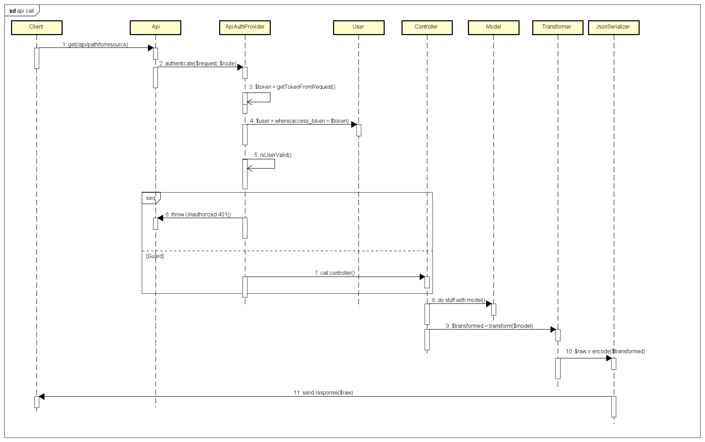

# Api

For the list of complete urls for the app, please visit the endpoint `/api`.
This view will list any route you may need, and the purpose of it.

This doc will details more the behind the scenes.

# How the api works in general

The api uses a module called `dingo/api`. 
This module adds a number of very useful features to the standard Api declaration of Laravel

General workflow on how the api works:



# Internal requests

Internal requests allow any controller from the app to communicate with api endpoints.
This is very usefull and allows all logic to happen in the api, thus DRYing up your codebase.

An example of an internal request would be `App\Http\Controllers\CarController@store`.

Instead of reroute the logic of creation of a car, we juts reroute it to the api.

In some cases, for example handling media, an api isn't adapted.
This means that media handling must be done in a "normal" controller, within `App\Http\Controllers`.

# Authentication

To authenticate with the api you may use 3 methods : 
 - ```token=ACCESSTOKEN``` in the query string
 - ```X-Access-Token=ACCESSTOKEN``` header in the request
 - ``` Authorization: x-acces-token ACCESSTOKEN ``` header in the request
 
 The access token comes from the `Lib\Models\User` model. This modal stores a special `accesstoken` field.
 If no token matches, the api throws a 403 Unauthorized.
 
 The you need to change anything with auth on the api take a look in `api/ApiAuthProvider`.
 __This is not a laravel service provider__
 
 
## Getting an access token

If you have seeded the database you have 2 access tokens available

| access token | Extra                  |
|--------------|------------------------|
| root         | Has admin rights       |
| runner       | Has normal user rights |

# Request Examples

Please visit `/api` and use the test functionality.

# What happens to models?

If you take a look at the data model, you will recognise that the api doesn't serve the same representation in responses.

That is due to an addition of an abstract layer called Transformers.
Transformers allow the api to render a piece of data, and altering it only to render. 
This makes the data model intact, but change it's final representation.

Now that can complicate a bit things sometimes (just check out the RunsController).

If you want to check out a transformer for a model, it will be in `api/Responses/Transformers`.

If you created a Transformer and need to register it. Do it in the `api/ApiServiceProvider` under `registerModelBindings`.

To create a transformer, you can inspire yourself from existing models. And if that doesn't suffice, visit [the transformer docs](http://fractal.thephpleague.com/transformers/)


# Creating a new ressource

Here's a small tutorial on how to create a new ressource, a new model interaction with the api.

## Create your model

You need to create your model and table first. Now do that
 
 ```
 php artisan make:model Profile --migration
 ```
 
 Now complete the migration file created `create_profile_table`
 
 And run `php artisan db_reset --production`
 
 To stay coherant with model logic, you should move your model RIGHT NOW from `app/Profile` to `lib/Models/Profile`
 
 For more details on why models are in `lib/`, [please check out the docs](models.md)
 
## Create your controller

First of lets create the file `api/Controllers/V1/ProfileController`

```
<?php

namespace Api\Controllers\V1;

use Api\Controllers\BaseController;
use Lib\Models\Profile;
use Illuminate\Http\Request;
use Symfony\Component\HttpKernel\Exception\UnauthorizedHttpException;

class ProfileController extends BaseController
{
    /**
     * Display a listing of the resource.
     *
     * @return \Illuminate\Database\Eloquent\Collection|static[]
     */
    public function index()
    {
        return Profile::all();
    }

    /**
     * Store a newly created resource in storage.
     *
     * @param  \Illuminate\Http\Request  $request
     * @return \Illuminate\Http\Response
     */
    public function store(Request $request)
    {
       return Setting::create($request->except(["token","_token"]));
    }
  
  /**
   * Display the specified resource.
   *
   * @param Profile $profile
   * @return \Illuminate\Http\Response|Profile
   */
    public function show(Profile $profile)
    {
        return $profile;
    }
  
  
  /**
   * Update the specified resource in storage.
   *
   * @param  \Illuminate\Http\Request $request
   * @param Profile $profile
   * @return \Illuminate\Http\Response|Setting
   */
    public function update(Request $request, Profile $profile)
    {
        $profile->update($request->except(["token","_token"]));
        return $settings;
    }
  
  /**
   * Remove the specified resource from storage.
   *
   * @param Profile $profile
   * @return \Illuminate\Http\Response
   */
    public function destroy(Profile $profile)
    {
      $profile->delete();
    }
}
```

That's it, you now have the basics of a working controller.

## Register your controller in your routes

Now that the controller is done, you still can't access it because it isn't registered in any routes.

Let's fix that shall we.

open up `api/routes.php`

and add
```
...
$api->group(["middleware"=>["api.auth"]],function(Dingo\Api\Routing\Router $api){
    ....
    $api->resource("profile","ProfileController");
    ....

```

And that's it, now ou can access it through `/api/profile`.

## Creating a transformer

Now let's say that we add a relationship to the profile, and we need to include it when we render.

First off
```
in Lib\Models\Profile
class Profile extends Model
{
    ...
    public function user(){
        return $this->belongsTo(User::class);
    }
}
```

And let's create a transformer in `api/Responses/Transformers/ProfileTransformer.php`

```

use League\Fractal\TransformerAbstract;
use Lib\Models\Profile;

class CarTypeTransformer extends  TransformerAbstract
{
  public $availableIncludes = [
    "user"
  ];
  public function transform(Profile $profile)
  {
    return [
      "profile_name"=>$profile->name,
      "some_other_data"=>$profile->something_else
    ];
  }
  public function includeUser(Profile $profile)
  {
    return $this->item($profile->user, new UserTransformer);
  }
}
```

To finish off, you know need to register it in `api/ApiServiceProvider`

```
use Lig\Models\Profile;
use Api\Responses\Transformer\ProfileTransformer;

class ApiServiceProvider extends RouteServiceProvider{
     
    protected function registerModelBindings(){
      app('Dingo\Api\Transformer\Factory')->register(Profile::class, ProfileTransformer::class);
      ....
    }
```

Now whenever you ask the api for /profile, it will trigger this Transformer. 

For more information on transformers please visit [the docs](http://fractal.thephpleague.com/transformers/).