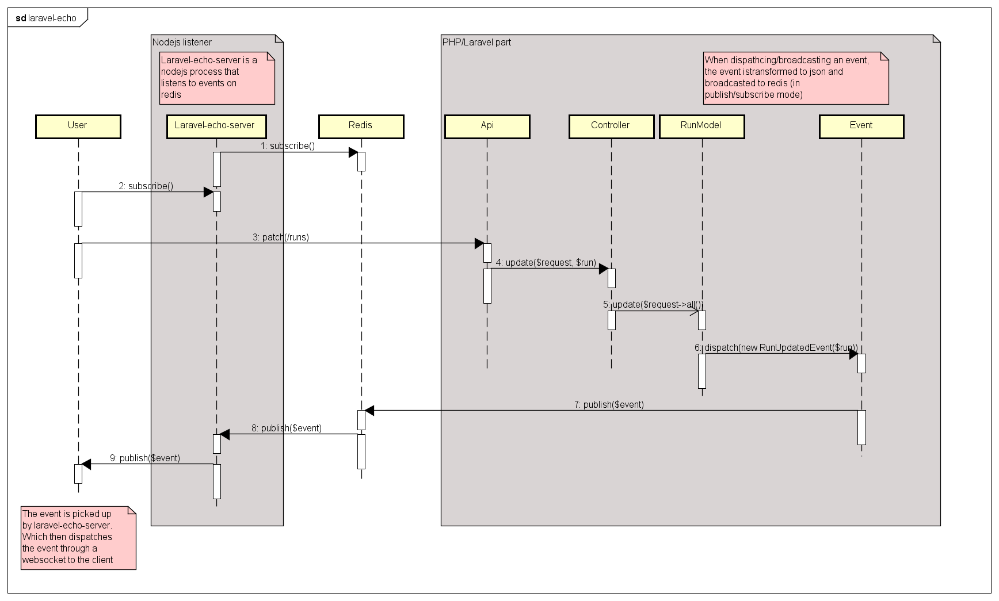

# Laravel-echo

Laravel-echo provides communication between a client (javascript) and the server (Laravel).

Laravel-echo is the client side library. On the server though a small utility server must be run.

This utility is called `laravel-echo-server`. 
This server utility will listen on a redis server any Laravel events, and broadcast them through websocket.

To send events to laravel-echo-server, you need to have a redis server installed.
Then you will need to change your '.env' and add/modify BROADCAST_DRIVER=redis

Events should implement the interface `ShouldBroadcast`.
For more information please refer to the [laravel documentation](https://laravel.com/docs/5.4/broadcasting).

## RunList

We use laravel-echo as an update mechanisme. Thus making the RunList realtime.